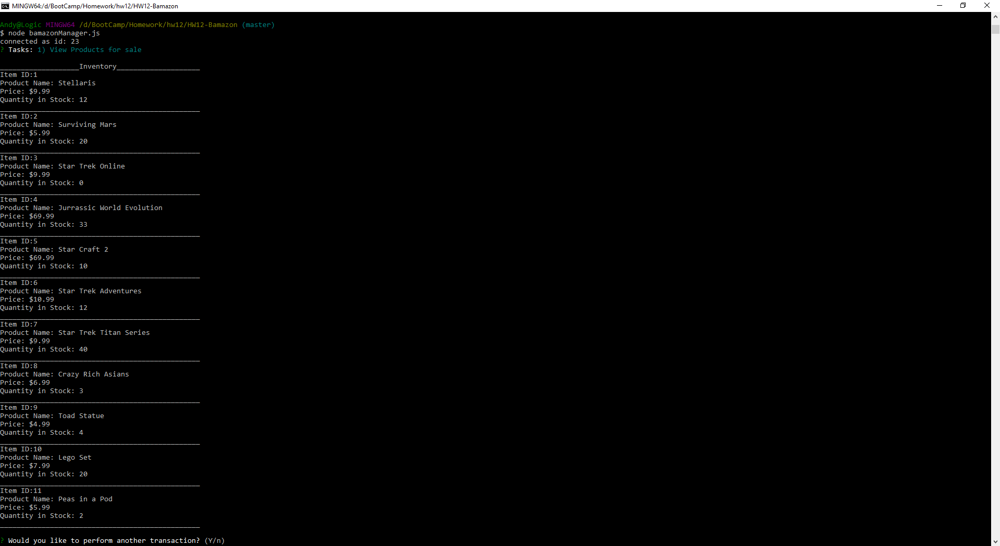
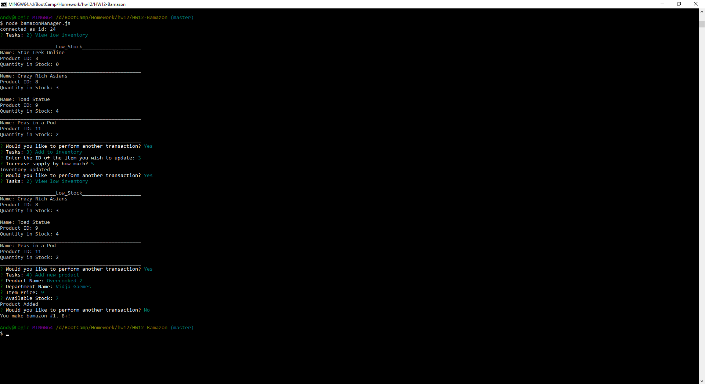
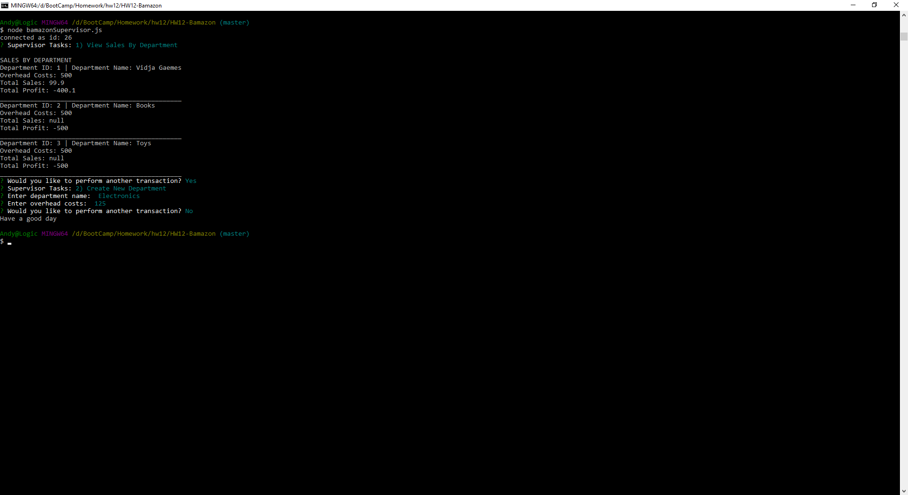

# HW12-Bamazon - Not as good as Amazon.

# Shoppers:

## bamazonCustomer.js allows shoppers to buy an item. When a product ID is selected it's quantity is checked on the database inventory then a total is sent to a separate table to track the department's profitability.

# Managment:

## bamazonManager.js allows Management to view in stock items, view low stock, add stock, and add new products.

# Supervisors:

## bamazonSupervisor.js allows Supervisors to view department sales or add new departments. 

